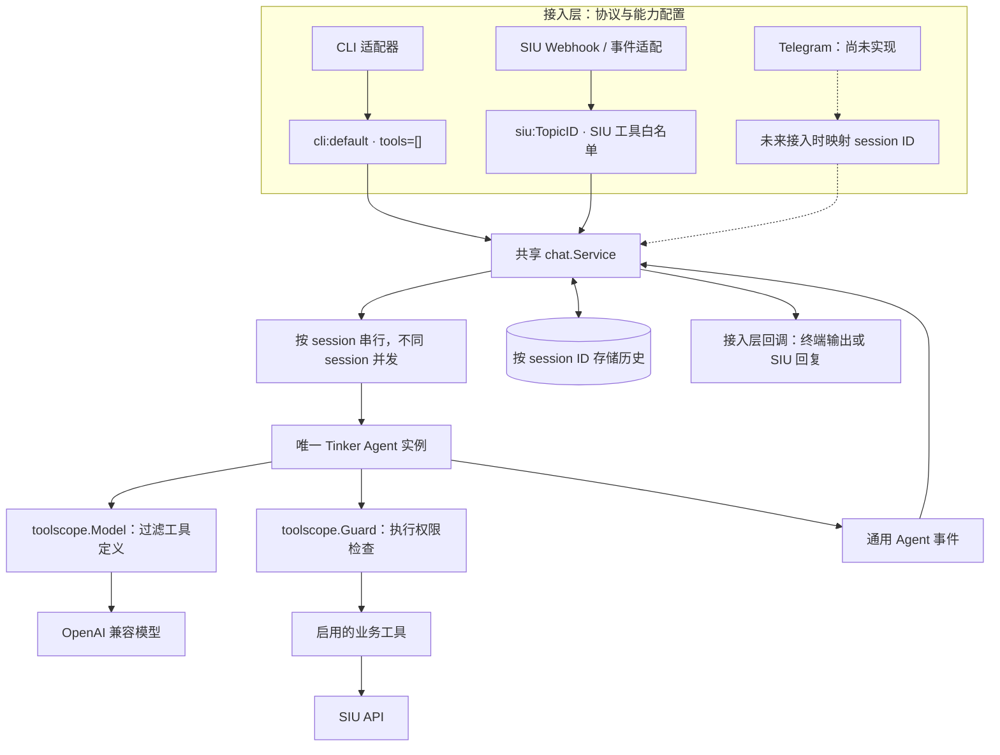
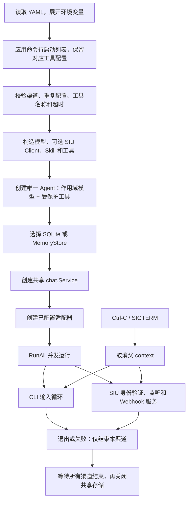
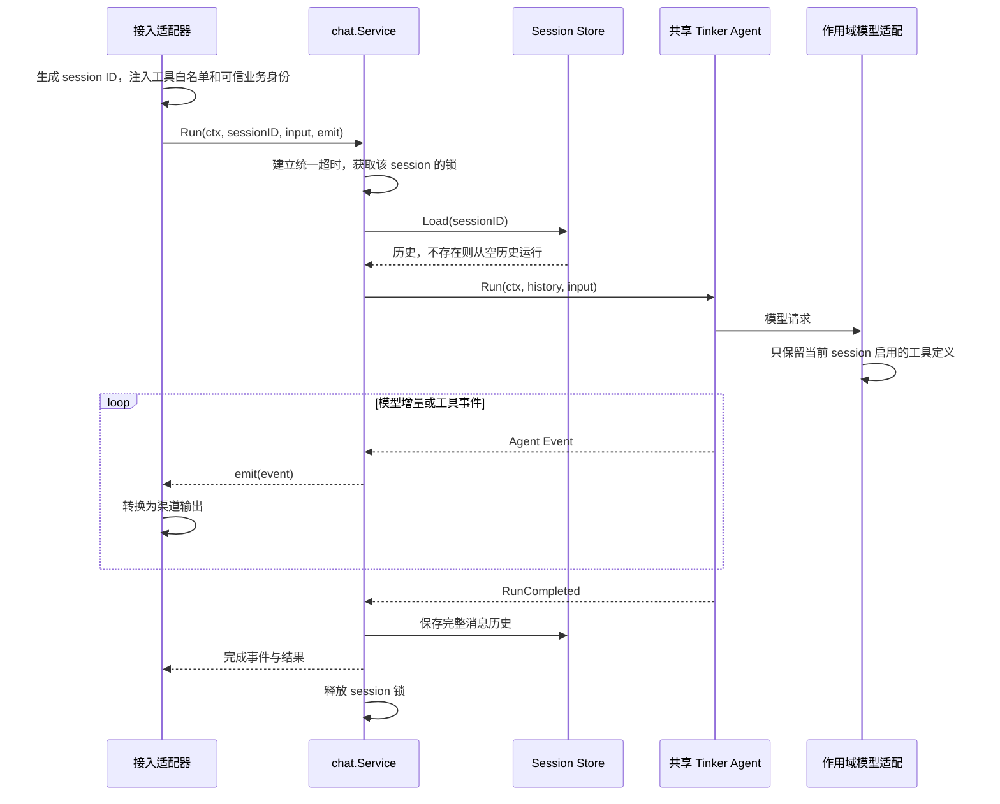
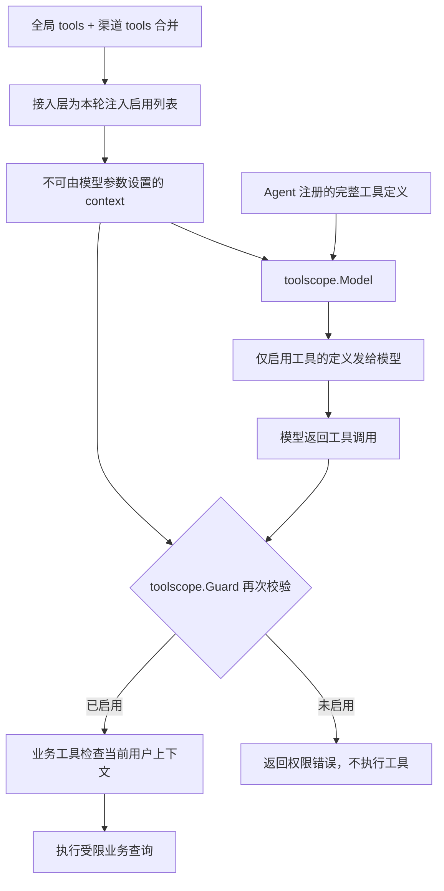
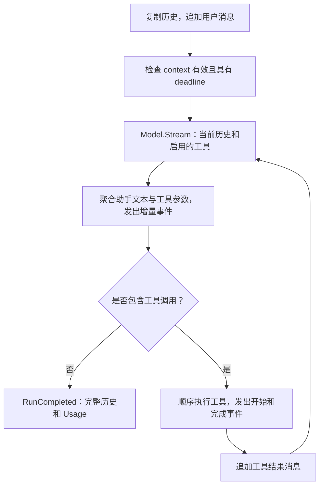
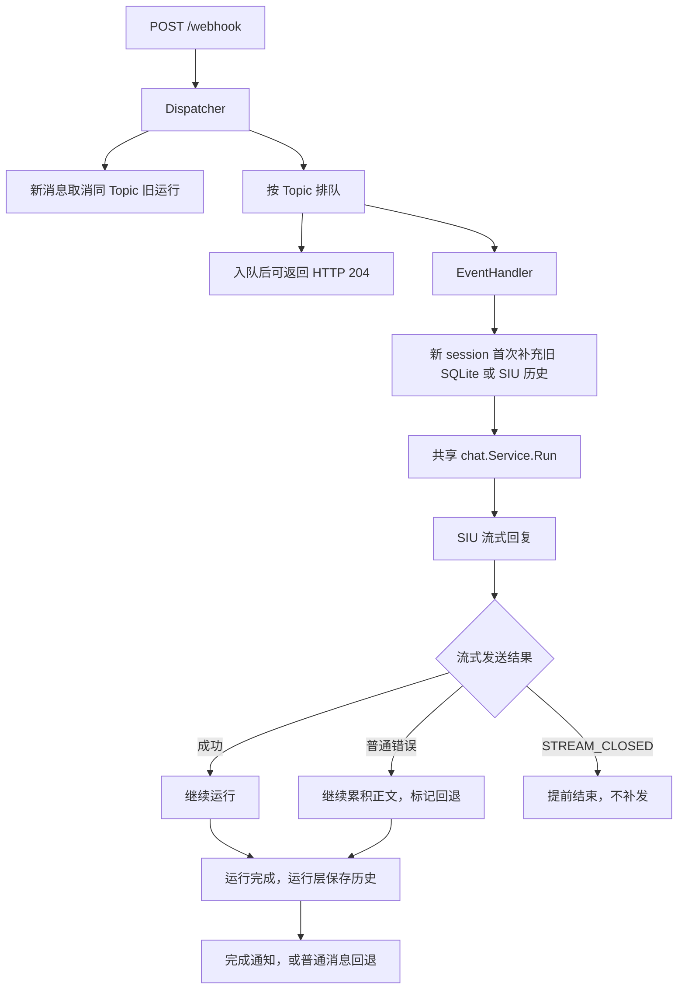

# TinkerBot 架构说明

对应 2026-09-06 当前工作区：一个共享 Tinker Agent，多个并发 channel，各自映射到独立 session。运行层不识别 CLI、SIU 或 Telegram，只接收 session ID、输入、运行 context 和事件回调。

## 1. 整体架构



CLI 和 SIU 不再分别构造 Agent。启动入口只创建一次模型、Agent、共享运行服务，再将服务传给各适配器。

| 层           | 模块                                  | 职责                                            |
| ------------ | ------------------------------------- | ----------------------------------------------- |
| 组装         | `cmd/tinkerbot/main.go`             | 配置、模型、工具、Agent、存储及适配器组装       |
| 接入         | `internal/channel/cli`              | stdin、stdout、命令和 CLI 会话 ID               |
| 接入         | `internal/channel/siu`              | SIU 身份验证、Webhook 注册、HTTP 生命周期       |
| SIU 适配     | `internal/events`、`internal/run` | 协议事件、Topic 调度、运行取消、消息交付        |
| SIU 历史适配 | `internal/conversation`             | 将旧历史或 SIU 历史转换为通用消息，注入用户身份 |
| 运行         | `internal/chat`                     | session 历史、单轮超时、同会话串行化            |
| 工具能力     | `internal/toolscope`                | 从可信 context 读取启用列表，控制可见性与执行   |
| 业务工具     | `internal/tools/siu`                | 当前用户消息和联系人查询                        |
| 存储         | `internal/storage`                  | SQLite 新 session 表及旧 SIU 表                 |
| Agent SDK    | 本地 Tinker                           | 模型流、工具调用循环、通用消息与事件            |

本地依赖为 `replace github.com/111hell/tinker => ../tinker`，要求将 Tinker 放在本项目的相邻目录。运行层与渠道适配在本项目中实现。

## 2. 启动与多渠道生命周期



支持 CLI 和 SIU 各一个同时运行，Telegram 尚未实现。单个渠道退出或运行失败不会取消其他渠道；失败立即记日志，`RunAll` 等全部渠道结束后返回错误。公共依赖构造或配置校验失败则无法进入运行阶段。

## 3. Session 处理时序



运行层将 session ID 当作不透明字符串。CLI 接入层使用 `cli:default`；SIU 接入层使用 `siu:<TopicID>`。命名空间避免渠道间会话碰撞，同一渠道的不同 Topic 也分别保存历史。

`Run`、`History`、`Initialize`、`Reset` 使用同一组 session 锁。同会话操作串行，不同会话可以并发；等待锁时可取消，锁无人持有或等待后回收。事件回调在锁内执行，不能重入同一 session 的运行服务。

模型错误、超时或增量事件回调失败时不提交该轮历史。`RunCompleted` 先写入历史，再交付完成事件。已显示的部分输出不会撤回；最终渠道交付失败也不会回滚已经保存的历史。

## 4. 工具 scope

工具实现一次注册到共享 Agent。工具列表由全局和渠道配置合并而成，再由每个 session 的可信 context 携带启用列表，模型请求和实际执行都检查这个列表。运行层和工具权限模块均不根据渠道名称分支。



| 渠道配置                   | 模型可见范围              | 实际查询范围                         |
| -------------------------- | ------------------------- | ------------------------------------ |
| CLI 显式`tools: []`      | 无业务工具                | 无 SIU 查询权限                      |
| SIU`siu_list_messages`   | 当前 session 能看到此工具 | 当前用户私聊，返回结果筛选当前 Topic |
| SIU`siu_search_contacts` | 当前 session 能看到此工具 | 当前用户联系人                       |
| SIU 显式`tools: []`      | 无业务工具                | 即使模型构造工具名，也不能执行       |

SIU 工具从接入层注入的 `UserID` / `TopicID` 读取业务身份，模型只能传入查询词和条数。给其他渠道添加 SIU 工具名称，不会自动赋予 SIU 用户身份；没有可信身份时工具报错。

工具过滤不修改共享注册表，context 内的启用列表独立复制，因此并发 session 不会互相改变工具范围。模型、系统提示词和 Skill 仍是共享配置；Skill 正文在启动时加入提示词，不负责授权。

## 5. Tinker Agent 循环



Tinker 持有模型、系统提示词和工具实现，不持有跨轮 session 历史。调用方使用统一 `agent.run_timeout` 限制运行；没有独立的最大工具步数。工具错误作为 JSON 错误结果交回模型，模型流错误终止该轮。

## 6. SIU 接入流程与兼容行为



SIU 适配层继续保留以下协议行为：

- 同 Topic 串行，跨 Topic 最多 8 个 Handler 并发；待处理事件最多 100 个，满时等待容量；空闲 lane 5 分钟回收。
- 新消息取消同 Topic 活跃运行，排队旧消息通过最新消息检查跳过。取消不会影响 CLI 或其他 Topic 的 context。
- `stop_responding` 取消运行；`skip_thinking` 只停止思考内容交付，不改变模型请求或正文运行。
- `fork_topic` 导入初始消息；`delete_topic` 删除新 session 及对应旧历史。
- 群消息、编辑消息、进入或离开聊天事件仍被忽略。
- 流式发送普通错误时继续累积正文，再回退普通消息；流已关闭则停止补发。最终交付在历史保存之后。

Webhook 204 表示事件分发完成，不表示模型回答完成。后台处理使用 Scheduler 的 context，不继承单次 Webhook 请求的取消。处理失败记录日志，不自动重试。

`internal/events`、`internal/conversation` 和 `internal/run` 是 SIU 适配实现的一部分；它们现在调用共享运行服务，不再直接构造或运行另一套 Agent。SIU 已统一使用全局提示词与 `agent.run_timeout`，原固定 30 分钟超时已移除。

当前 `openaicompat` 不映射供应商的 reasoning 字段；SIU 思考内容交付分支仅在运行时实际收到 `Delta.Reasoning` 时生效。

## 7. 存储、配置与兼容

| 项目         | 当前行为                                                                            |
| ------------ | ----------------------------------------------------------------------------------- |
| 新历史表     | `agent_sessions`，主键为 session ID，消息保存为 JSON                              |
| 旧 SIU 表    | `conversations`，主键为原始 TopicID，仅用于兼容补充历史                           |
| 旧数据导入   | 新 SIU session 不存在时读取旧历史；没有旧历史时查询 SIU，初始化时不覆盖已有 session |
| 内存模式     | `sqlite.path: ""`，所有历史随进程退出清空                                         |
| SQLite 模式  | 路径非空，所有 channel 的 session 都持久化；默认`tinkerbot.db`                    |
| 统一配置模板 | `config.example.yaml`，使用 `tinkerbot.db`；临时会话可设空路径                  |
| 历史裁剪     | 尚未实现，每轮传入累计完整历史                                                      |
| 隔离边界     | 新旧表分开，原始 TopicID 无法碰撞另一个渠道的新 session 行                          |

SIU 首次远端补充查询最近 100 条私聊消息，筛选当前 Topic，排除删除消息和当前消息及其后的消息，按旧到新排序；当前消息不在这一页时结果为空。该行为没有扩展为全量分页补齐。

```yaml
tools: [] # 全局通用工具
channels:
  - type: cli
    tools: []
  - type: siu
    tools: [siu_list_messages, siu_search_contacts]
agent:
  system_prompt: "You are a helpful assistant."
  run_timeout: 2m
sqlite:
  path: tinkerbot.db
```

旧 `channel.type` 配置继续支持，但不能与 `channels` 同时出现；未配置渠道时默认 CLI。`-channel cli,siu` 覆盖启动列表，同时保留 YAML 中已配置渠道的工具名单。未知渠道、重复渠道、未知工具、空启动列表和非正超时会被拒绝。全局 `tools` 与渠道 `tools` 按此顺序合并，重复项只保留一次；空列表不会移除另一层的工具。全局与渠道都未配置时，CLI 默认无工具、SIU 默认两个查询工具。

`model.*`、`agent.*`、`skills_dir` 为共享配置。SIU 的地址、凭证、Webhook 和监听地址仍由接入层使用。环境变量从进程环境展开，程序不自动加载 `.env`。

## 8. 验证与源码入口

关键代码：[组装入口](https://github.com/111hell/tinkerbot/blob/main/cmd/tinkerbot/main.go)、[共享运行服务](https://github.com/111hell/tinkerbot/blob/main/internal/chat/service.go)、[工具能力校验](https://github.com/111hell/tinkerbot/blob/main/internal/toolscope/scope.go)、[多渠道生命周期](https://github.com/111hell/tinkerbot/blob/main/internal/channel/run.go)、[SIU 适配器](https://github.com/111hell/tinkerbot/blob/main/internal/channel/siu/siu.go)。

仓库不包含 `_test.go` 文件，使用 `go build ./...` 和 `go vet ./...` 进行构建与静态检查。真实模型或 SIU 服务仍需另行联调。Telegram 尚未实现，需要新增接入适配器、身份映射及渠道配置；共享运行层不需要增加 Telegram 分支。
